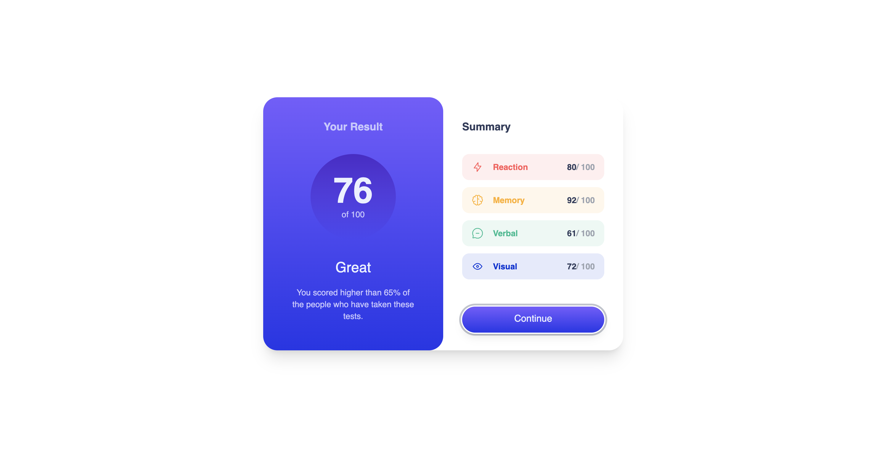
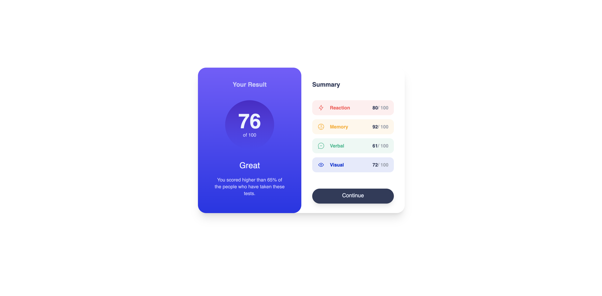
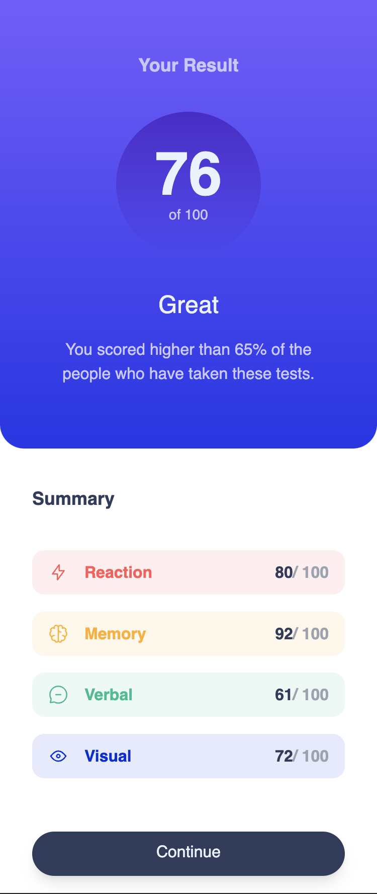

# Frontend Mentor - Results summary component solution
This is a solution to the [Results summary component challenge on Frontend Mentor](https://www.frontendmentor.io/challenges/results-summary-component-CE_K6s0maV). This project is built using React and Tailwind CSS. 

## Table of contents

- [Overview](#overview)
  - [The challenge](#the-challenge)
  - [Screenshot](#screenshot)
  - [Links](#links)
- [My process](#my-process)
  - [Built with](#built-with)
  - [What I learned](#what-i-learned)
- [Author](#author)

## Overview

### The challenge

Users can:

- View the optimal layout for the interface depending on their device's screen size
- See hover and focus states for all interactive elements on the page
- Content populated dynamically using the JSON data file provided 

### Screenshot

### Prerequisites

- Node.js and npm installed on your machine. 

### Setup

1. Clone the repository:

git clone https://github.com/BKFOE/results_summary_component.git

2. Navigate to the project directory:

cd results-summary-component

3. Install the necessary dependencies:

npm install 

4. Run the development server and view project locally:

npm run dev

### Links

- Solution URL: [Github](https://github.com/BKFOE/results_summary_component.git)
- Live Site URL: [Add live site URL here](https://your-live-site-url.com)

## My process

### Built with

- [Tailwind](https://tailwindcss.com/) - Tailwindcss
- [Vite](https://vitejs.dev/) - Vite 
- [React](https://reactjs.org/) - JS library

### What I learned

After running npm build, I encountered an issue where Vite's build process purged some of the dynamic classes from my Tailwind CSS setup. As a result, some colors defined in my data file were stripped out in the production build. To resolve this, I had to explicitly reference these classes in my source files and use the safelist option in my tailwind.config.js file. This ensured that Vite included the necessary classes in the production build, preserving all the colors that were removed.
              
## Author

- Website - [BKFOE](https://github.com/BKFOE)
- Frontend Mentor - [@BKFOE](https://www.frontendmentor.io/profile/bkfoe)
